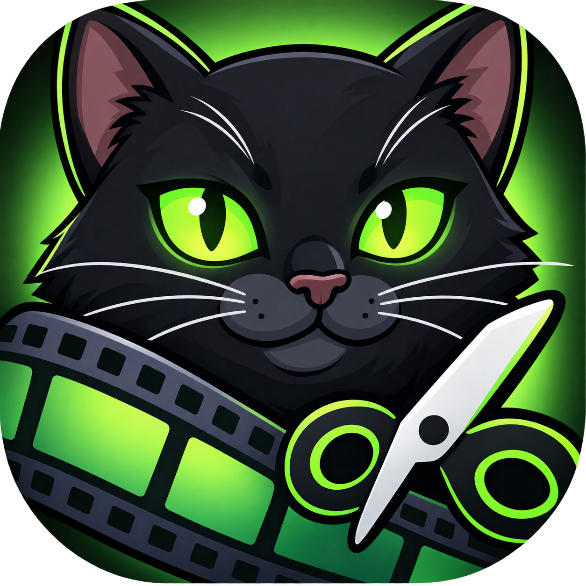

# Meows Cut



Настольный видеоредактор под Windows 10 и новее: доска монтажа с ножницами и клипами,
без тяжести большого NLE. Всё считается локально, ничего никуда не отправляется.

C# / .NET 8 / WPF / MVVM / FFmpeg. Интерфейс русский.

## Что умеет

**Монтаж.** Резать, переставлять и двигать куски по ленте; между ними бывают зазоры —
в них при экспорте чёрный кадр. Скорость от 0.1× до 16×, кадрирование, копирование
и вставка. Отмена любого шага.

**Звук.** Отдельные дорожки поверх звука видеоряда: наложить музыку, подставить другую
дорожку вместо родной, сдвинуть реплику. Громкость, тональность (±12 полутонов),
нарастание и затухание, тишина дорожки. Волна нарисована прямо в куске звука.
Звук длиннее видео продлевает ролик чёрным кадром.

**Фотографии** кладутся в видеоряд как обычные клипы, длину задаёте вы.

**Экспорт.** MP4, MKV, WebM, MOV, AVI; H.264, H.265, VP9, AV1; постоянное качество,
битрейт или подгон под размер файла. Аппаратное кодирование (NVENC, Quick Sync, AMF),
если оно на машине действительно работает — это проверяется пробным кадром, а не
списком `ffmpeg -encoders`. Субтитры: вшить в кадр или положить дорожкой.

**Пресеты площадок** с их ограничениями (в том числе видеостикеры и видеоэмодзи
Telegram) живут в JSON и правятся без пересборки — свои кладутся
в `%APPDATA%\MeowsCut\presets` и перекрывают встроенные.

## Установка

В репозитории лежат только исходники: ни `.exe`, ни FFmpeg (328 МБ) сюда не коммитятся.
Готовые файлы получаются сборкой — см. ниже; оба варианта self-contained, на машине
пользователя не нужны ни .NET, ни FFmpeg.

| Что раздавать | Как получить | Размер |
|---|---|---|
| `publish\installer\MeowsCut-<версия>-setup.exe` | `./tools/build-installer.ps1` | ~137 МБ |
| `publish\MeowsCut.zip` — распаковал и запустил | `./tools/publish-portable.ps1 -Zip` | ~187 МБ |
./tools/publish-portable.ps1 -Zip      # архив
./tools/build-installer.ps1 -Version 0.1.0   # установщик
dotnet run --project src/MeowsCut.App  # запуск при разработке

Установщик ставит приложение в профиль пользователя и делает ярлык в меню «Пуск»,
права администратора не нужны. Portable-папку достаточно скопировать — FFmpeg лежит
рядом с `MeowsCut.exe` и находится вторым шагом поиска.

## Сборка из исходников

Нужен .NET SDK 8 и FFmpeg с FFprobe.

```powershell
./tools/get-ffmpeg.ps1          # положит ffmpeg в %LOCALAPPDATA%\MeowsCut\ffmpeg
dotnet run --project src/MeowsCut.App
```

Portable-папка и установщик:

```powershell
./tools/publish-portable.ps1 -Zip
./tools/build-installer.ps1     # нужен Inno Setup
```

Тесты: `dotnet test`. Интеграционные сами пропускаются, если FFmpeg не найден.

## Как это устроено

Три слоя: `MeowsCut.Core` (модель монтажа и правил, не знает ни про WPF, ни про FFmpeg),
`MeowsCut.Ffmpeg` (планировщик экспорта и запуск процессов), `MeowsCut.App` (интерфейс).
Последовательность иммутабельна, любая правка — команда в истории отмен.

Подробности — в [docs](docs/README.md): архитектура, модель предметной области, работа
с FFmpeg, журнал принятых решений с обоснованиями и журнал состояния работ.

## Лицензия

Не выбрана. FFmpeg распространяется отдельно под своей лицензией (GPL для сборок,
которые кладёт `tools/get-ffmpeg.ps1`) — его бинарники в репозитории не хранятся.
